# 👩🏻‍💻 Daniel Nathan

**`Estudante de ADS`**

Me chamo Daniel Nathan, tenho 20 anos. Atualmente, estou cursando Análise e Desenvolvimento de Sistemas na FATEC e estou buscando aperfeiçoar minha habilidades com BackEnd, Cloud e dados.

---

### 🤖 Linguagens e Tecnologias

 
 

### 📊 Estatísticas

